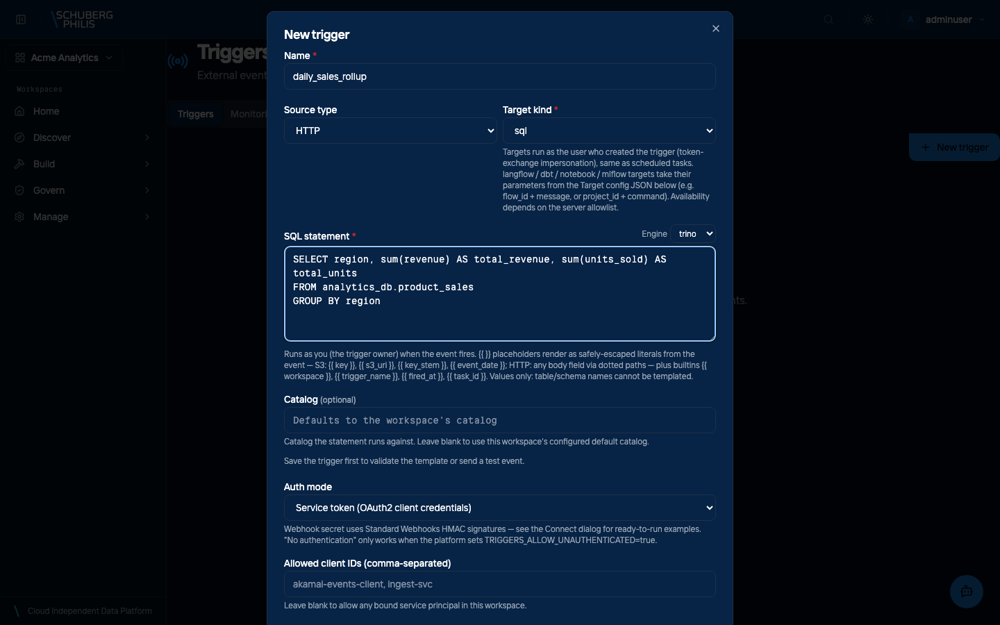
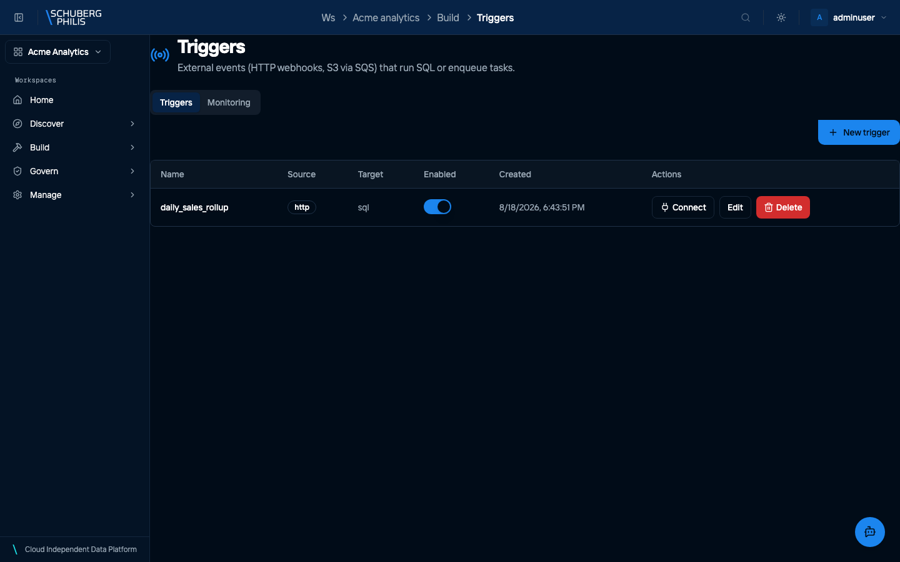
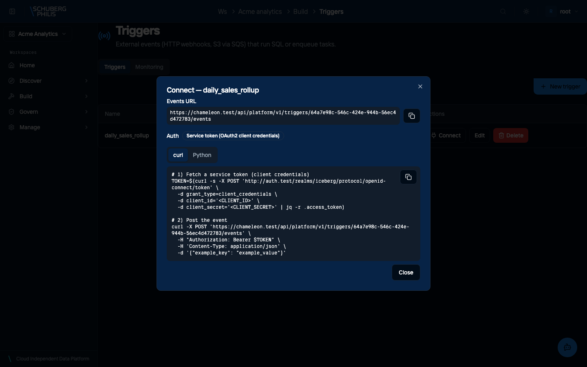
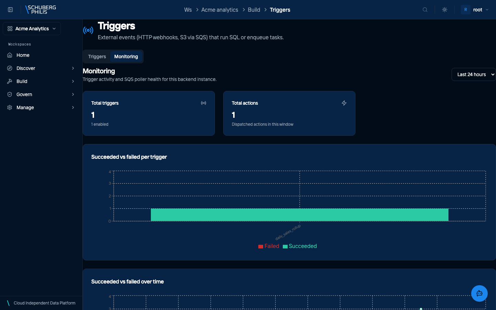
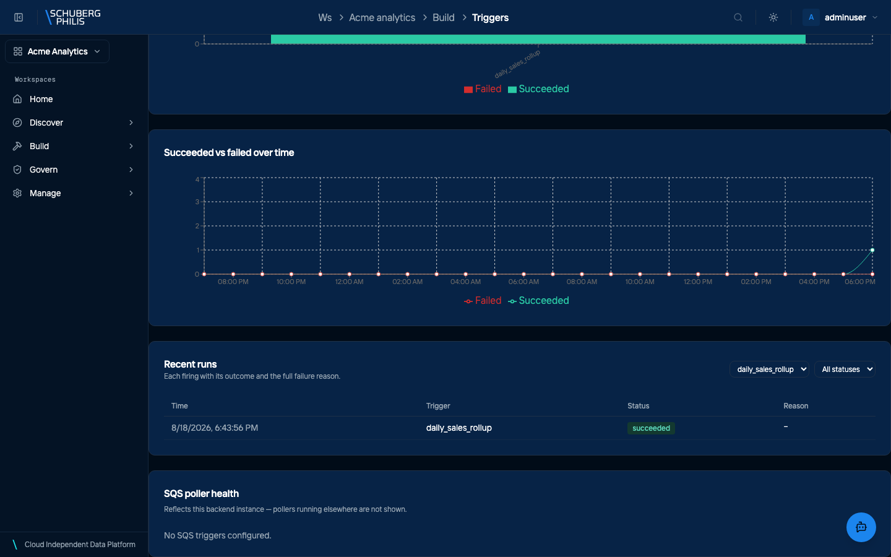

{/* GENERATED by docs-site/scripts/gen-tutorials.mjs.
    Narrative: src/data/tutorials/<id>.json. Steps and screenshots come from
    the use-cases a capture run executed. */}

**Who this is for:** Data engineer · **Time:** About 30 minutes

## What you will end up with

A dbt project building tested, documented tables in your own catalog — with lineage you can read, a trigger that rebuilds them when new data lands, and a colleague able to query the result.

This is the whole path, in order: find what exists, query it, build models from a git repository, prove they are correct, make them rebuild on their own, and hand access to someone else. Every screenshot below came from a run that actually performed the step.

If you only read one thing first: a **workspace** owns exactly one **catalog**, and everything you build lands in it. That is the boundary that keeps your tables yours.

## Before you start

- A workspace, and membership of its admin group. Ask a platform administrator if you do not have one — `manage-workspace` shows what they do.
- A git repository containing a dbt project. The tutorial uses a small one with seeds, staging models and gold models.
- Nothing installed locally. Everything here happens in the browser; the CLI and API equivalents are linked at each step.

## 1. Sign in

The platform authenticates through Keycloak, and the backend keeps your tokens server-side — the browser only ever holds a session cookie. Nothing you do later depends on a token you have to manage.

- Open the portal and review the sign-in options

  

- Sign in, landing on the administration overview

  

[Full detail, and how to do this without the UI](/docs/guides/use-cases/sign-in/)

## 2. See what already exists

Start in the catalog rather than in your editor. A table here is an Iceberg table that every engine on the platform reads the same way, so what you find is what dbt, SQL and Spark will all see.

Look at the table's schema before you model it. Column names and types here are the contract your models will depend on.

- Open the catalog explorer

  

- Open the catalog to see its properties and contents

  

- Open a namespace to list its tables

  

- Open a table to read its Iceberg metadata

  

[Full detail, and how to do this without the UI](/docs/guides/use-cases/browse-catalog/)

## 3. Ask a question in SQL

Query before you build. A query runs as **you**, so what you can see here is exactly what your grants allow — if a table looks empty, that is an access answer, not an empty table.

This is also the fastest way to check an assumption before writing a model that encodes it.

- Open the query editor

  

- Run a SELECT and read the results

  

[Full detail, and how to do this without the UI](/docs/guides/use-cases/run-query/)

## 4. Build models with dbt

This is the heart of it. The platform clones your repository, runs dbt against your workspace's catalog **as you**, and records what each run produced.

Two things worth doing in order: run `seed` before `run` the first time, so the source data exists; and read the lineage graph after the run rather than before, because that is where the shape of what you built becomes obvious. Then run the tests — a model that builds is not the same as a model that is right.

- Connect the git repository that holds the dbt project

  

- Create a dbt project from that repository

  

- Open the project: the repository files, ready to edit and run

  

- Load the seed data, then build the models — dbt output as it runs

  

- Read the lineage the run produced, from seed through to the final model

  

- Run the project tests, and see which models they cover

  

[Full detail, and how to do this without the UI](/docs/guides/use-cases/dbt-lifecycle/)

## 5. Make it rebuild on its own

A pipeline you have to remember to run is a pipeline that will be stale. A trigger turns an outside event — a file landing in S3, or an authenticated HTTP call from whatever produces your data — into the same work you just did by hand.

Start with `Test fire`. It dispatches through the real path and shows up in Monitoring like any other firing, so you can prove the wiring before anything depends on it.

- Open the Triggers page for the workspace
- Describe the trigger: a name, an HTTP source, and how callers authenticate

  

- Create it, and see it listed for the workspace

  

- Read the connection details a caller needs: the events URL and a worked example

  

- Send a test event, so the trigger fires through the real dispatch path
- Check the Monitoring tab: how many actions each trigger dispatched

  

- Read the recent runs for one trigger — each firing, its outcome, and any reason

  

[Full detail, and how to do this without the UI](/docs/guides/use-cases/triggers/)

## 6. Give your team access

Tables you cannot share are not finished. Authorization is decided by Apache Ranger for the **end user**, not for the engine, so a grant you make here applies whether your colleague uses SQL, Spark or a notebook.

Grant to a group rather than a person where you can: it survives people joining and leaving.

- Open Access Control to review existing grants

  

- Open the Grant Access dialog and choose a privilege and securable

  

[Full detail, and how to do this without the UI](/docs/guides/use-cases/grant-access/)

## Where to go next

- Put the project on a schedule as well as a trigger, so it rebuilds even when nothing fires.
- Add a data contract to the tables other teams depend on, so a breaking change is caught before it ships.
- Read the lineage from the table side rather than the project side — it spans engines, not just dbt.
