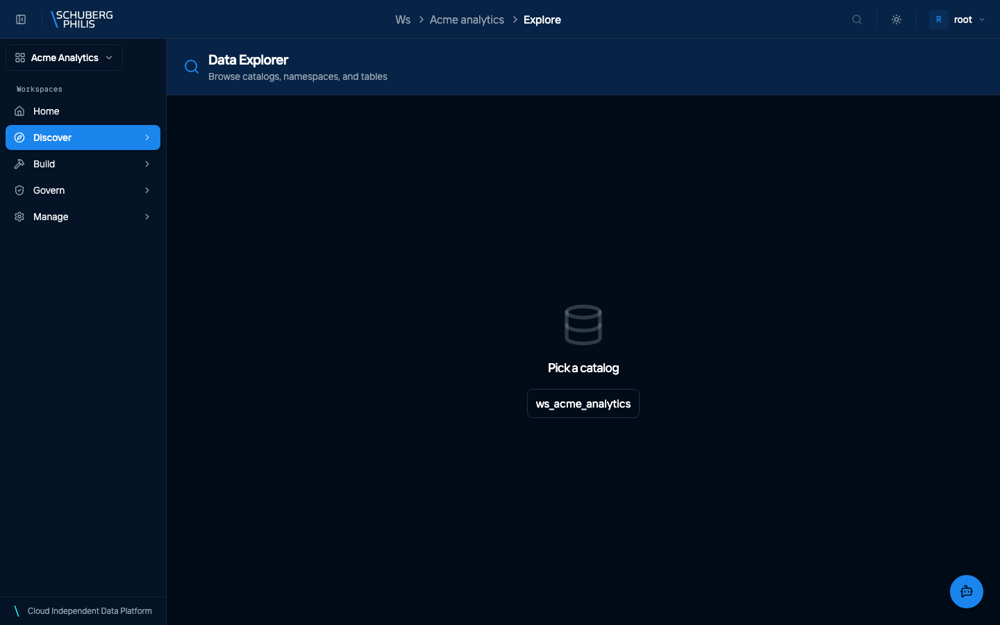
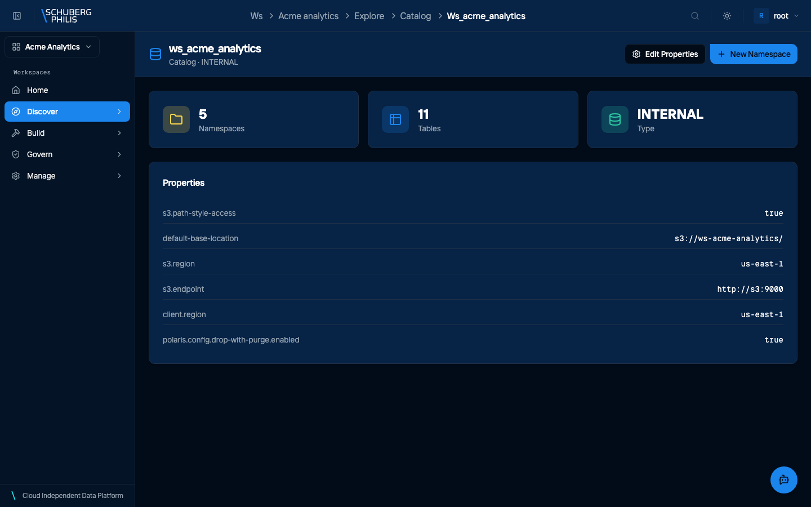
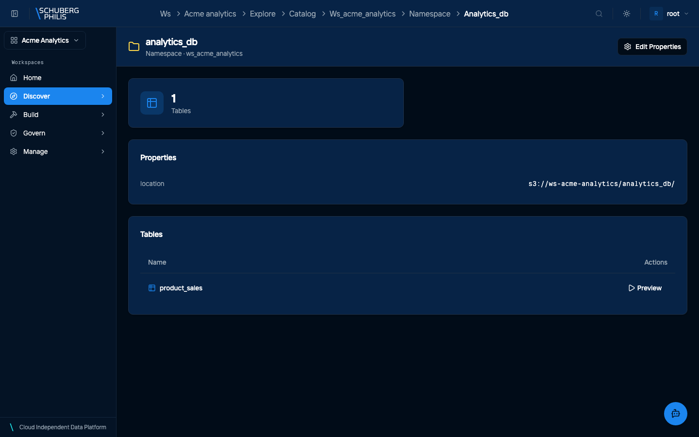
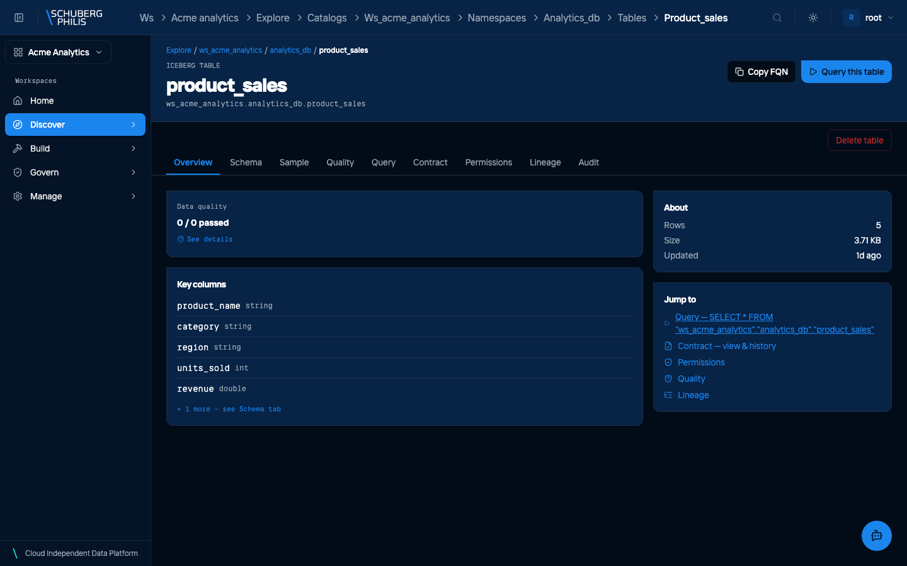
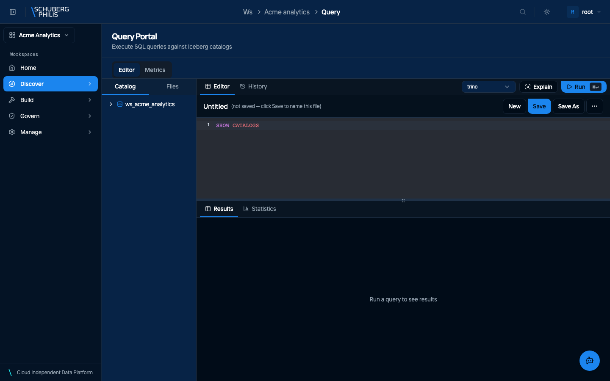
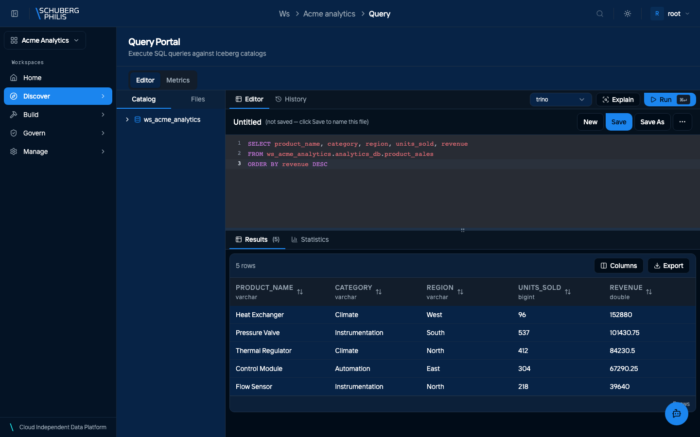
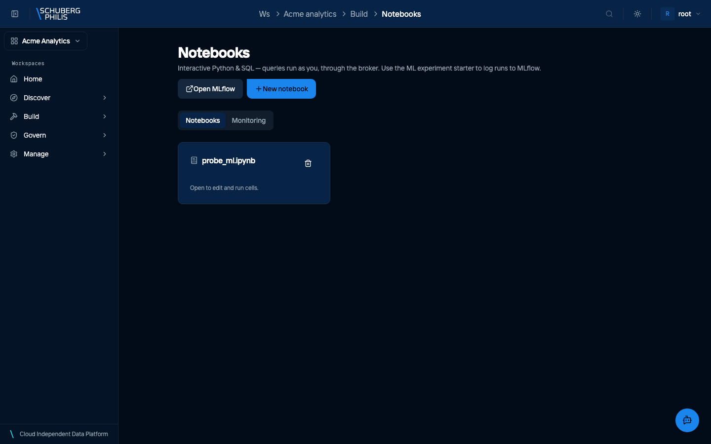
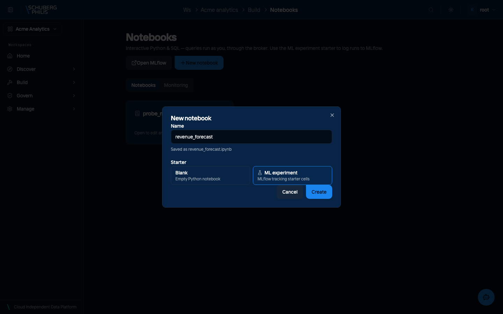
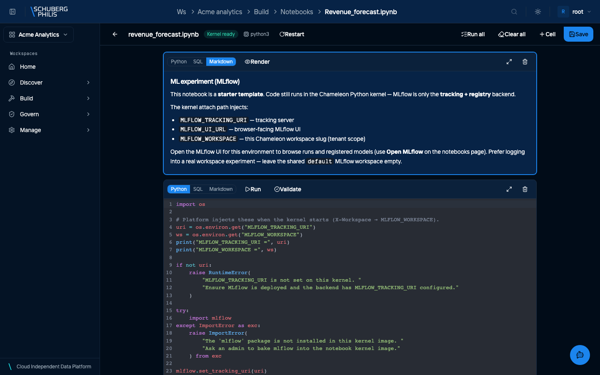

{/* GENERATED by docs-site/scripts/gen-tutorials.mjs.
    Narrative: src/data/tutorials/<id>.json. Steps and screenshots come from
    the use-cases a capture run executed. */}

**Who this is for:** Data scientist · **Time:** About 25 minutes

## What you will end up with

A dataset you found and understood, a notebook running next to it with a kernel of its own, and an experiment whose runs are recorded rather than remembered.

The shortest description of this platform for your purposes: **the code runs next to the data**. You do not extract a CSV, you do not keep a copy on a laptop, and you do not lose the record of what you tried.

The path is ordinary — find a table, query it, open a notebook, track the experiment. What is worth paying attention to is where each of those runs and under whose identity, because that is what makes the result reproducible by somebody who is not you.

## Before you start

- Membership of a workspace. Everything below happens inside one, and the notebook's kernel belongs to it.
- Python. The notebook kernel is `python3`; SQL and Markdown cells are available in the same notebook.
- No local setup. There is nothing to install, and nothing to configure to reach the data — the kernel is already pointed at it.

## 1. Find a dataset

Read the schema before you model anything. Column names and types here are the contract — and the catalog is shared, so what you find is what your colleagues will see when they check your work.

If a table you expect is missing, that is usually an access answer rather than an absence. Ask for a grant before assuming the data does not exist.

- Open the catalog explorer

  

- Open the catalog to see its properties and contents

  

- Open a namespace to list its tables

  

- Open a table to read its Iceberg metadata

  

[Full detail, and how to do this without the UI](/guides/use-cases/browse-catalog/)

## 2. Understand it in SQL first

A query is faster than a notebook for the first questions: how many rows, what is the range, how many nulls. It runs as **you**, so what comes back is exactly what you are permitted to see.

Doing this first also saves the classic waste — an hour of pandas built on an assumption that one `GROUP BY` would have corrected.

- Open the query editor

  

- Run a SELECT and read the results

  

[Full detail, and how to do this without the UI](/guides/use-cases/run-query/)

## 3. Open a notebook with a kernel of its own

Start from the **ML experiment** template rather than a blank notebook. It opens with MLflow tracking already wired, and the kernel arrives with `MLFLOW_TRACKING_URI` and `MLFLOW_WORKSPACE` set for this workspace — so a run you log lands in your workspace's experiment rather than in a shared default nobody curates.

Wait for **Kernel ready** before running a cell. The kernel is started per workspace and can take a moment on a cold platform; if it never becomes ready, restart it rather than assuming your code is at fault.

Use the **Open MLflow** button on the notebooks page to browse runs and registered models once you have logged some.

- Open Notebooks for the workspace

  

- Start one from the ML experiment template, which arrives with tracking set up

  

- The notebook opens with its kernel running, ready to execute

  

[Full detail, and how to do this without the UI](/guides/use-cases/notebook-analysis/)

## 4. Share the result

A finding nobody else can reproduce is an anecdote. When you write results back as a table, grant access to the group that needs it — the grant applies whichever tool they use, so a colleague can check your work in SQL even though you produced it in Python.

The reverse is also true and worth knowing before you debug it: if your notebook cannot see a table, no amount of Python will help. The answer is a grant.

- Open Access Control to review existing grants

  

- Open the Grant Access dialog and choose a privilege and securable

  

[Full detail, and how to do this without the UI](/guides/use-cases/grant-access/)

## Where to go next

- Promote the parts that others depend on into dbt models, so they are built and tested on a schedule rather than by hand.
- Register a model in MLflow once it is worth keeping, rather than leaving it as the best run of an experiment.
- Read the lineage of the table you used. Knowing what produced your input is part of knowing whether your result is sound.
