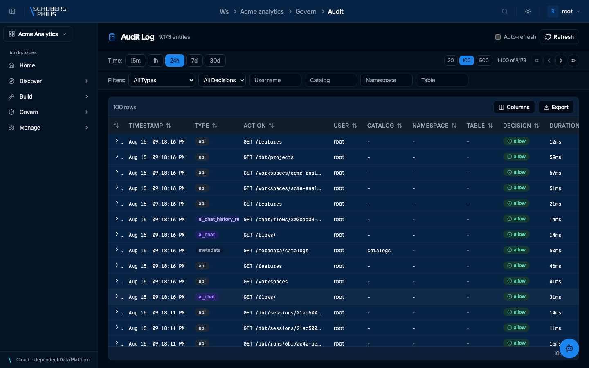
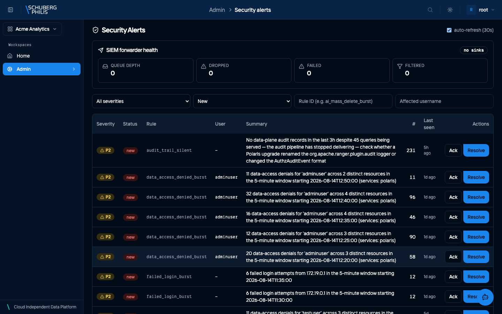
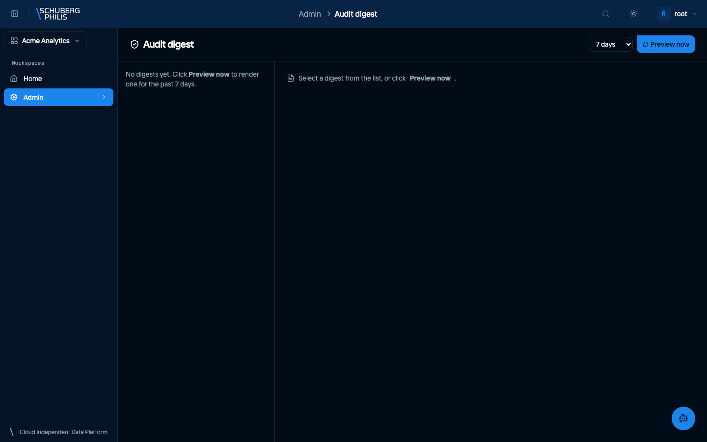

{/* GENERATED by docs-site/scripts/gen-usecases-reference.mjs.
    Steps and screenshots come from the capture run — edit the use-case in
    frontend/e2e/usecases/definitions/. Prose goes in
    src/content/use-case-intros/<id>.intro.md, and the CLI/MCP/API routes in
    src/data/use-case-surfaces.json. */}

Every data access is recorded with the identity that made it and the decision that was reached — not just that a query ran, but whether it was permitted. Events are emitted in OCSF, the schema SIEM tools consume, so the platform feeds an existing security pipeline rather than being another silo to check.

**Who does this:** admin

## Steps

1. Open the workspace Audit Log: who reached which table, and what was decided

   

2. Review Security Alerts: what the platform flagged without being asked

   

3. Build an audit digest — a period summarised, for the review nobody attends live

   

## Other ways to reach this

The steps above were executed against a live platform and photographed. The
commands below were not: they are checked to exist when the documentation is
built, which is a weaker guarantee. Follow the links for arguments and options.

### Command line

- [`chameleon admin audit`](/reference/cli/)
- [`chameleon access audit`](/reference/cli/)

### MCP tools

No MCP tool reads the audit trail. That is deliberate rather than missing: an assistant that can read every access record is a different risk from one that can read data it has been granted.

### HTTP API (for developers)

- [`GET /api/platform/v1/audit`](/reference/api/operations/get_audit_log_api_platform_v1_audit_get/)
- [`GET /api/platform/v1/access/audit`](/reference/api/operations/audit_access_api_platform_v1_access_audit_get/)
- [`GET /api/platform/v1/security/alerts`](/reference/api/operations/list_alerts_api_platform_v1_security_alerts_get/)
- [`POST /api/platform/v1/security/digests/preview`](/reference/api/operations/preview_audit_digest_api_platform_v1_security_digests_preview_post/)

Events are emitted in OCSF, the schema SIEM tools consume, so the forwarder feeds an existing pipeline rather than requiring a bespoke integration.
