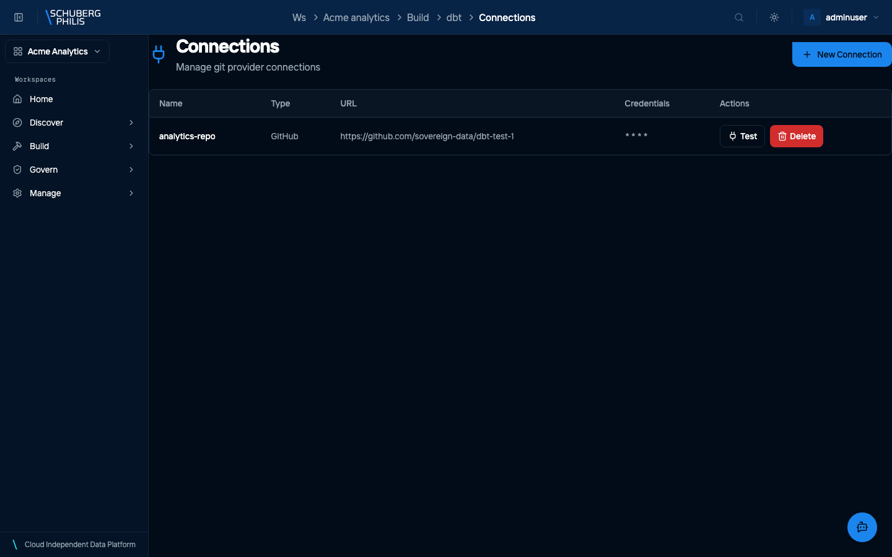
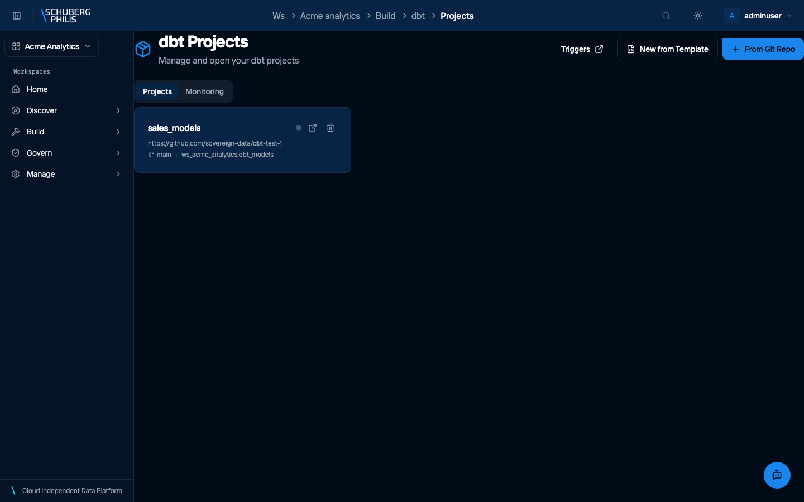
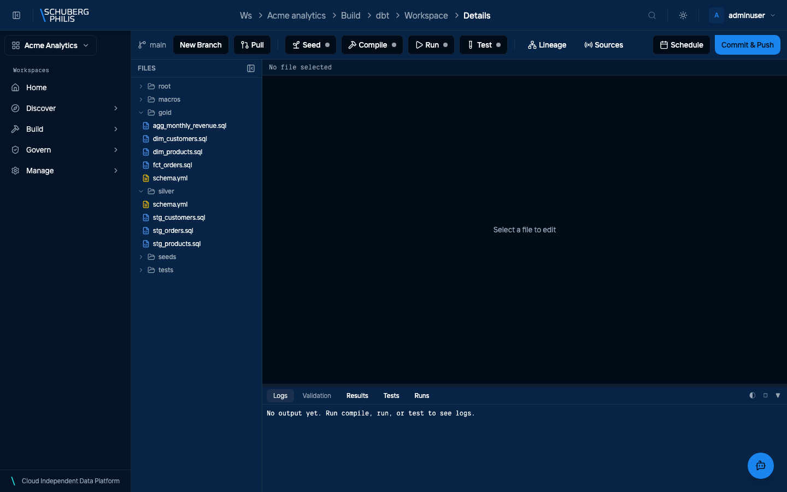
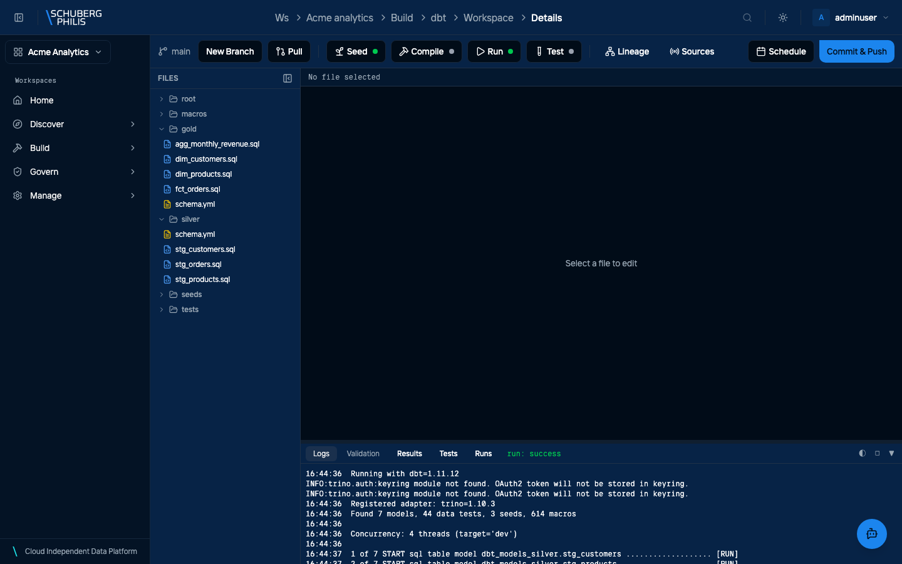
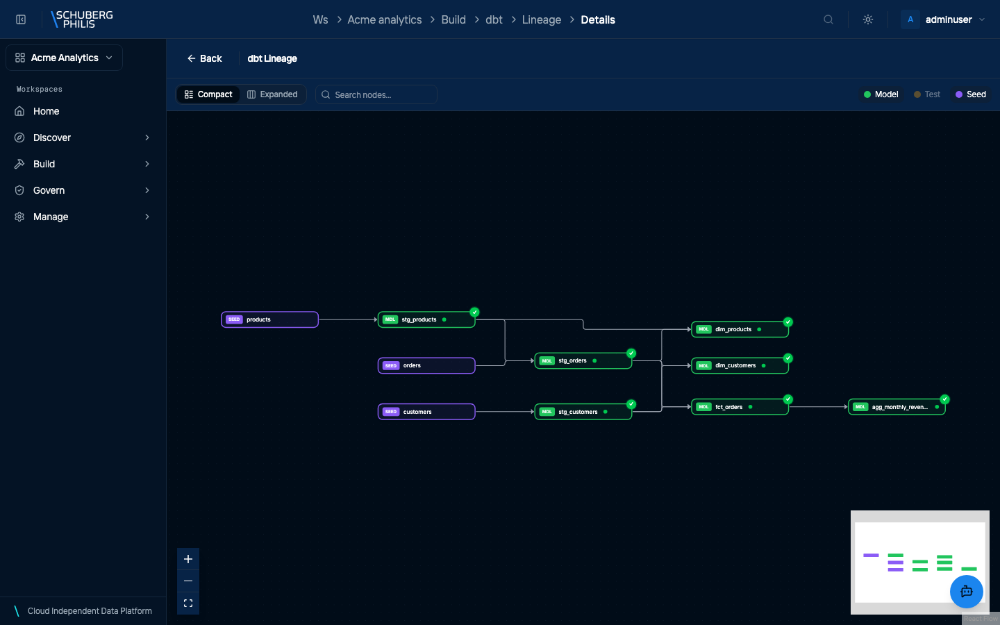
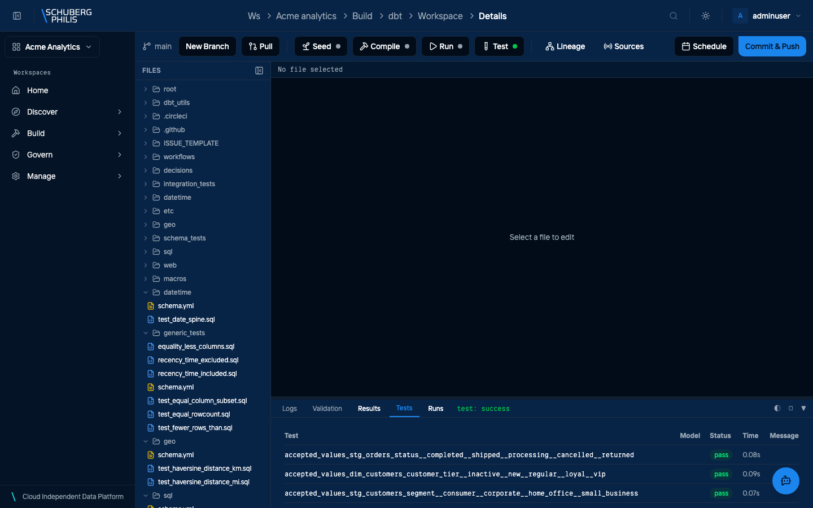

{/* GENERATED by docs-site/scripts/gen-usecases-reference.mjs.
    Steps and screenshots come from the capture run — edit the use-case in
    frontend/e2e/usecases/definitions/. Prose goes in
    src/content/use-case-intros/<id>.intro.md, and the CLI/MCP/API routes in
    src/data/use-case-surfaces.json. */}

dbt turns SQL files in a git repository into managed tables. The platform clones the repository, runs dbt against the workspace catalog as the person who asked, and records what each run produced — so the models, their lineage and their test results are part of the catalog rather than something tracked separately.

dbt runs against the platform the same way you do, so a model is built by an
identity with grants — not by a privileged pipeline account. The lifecycle below
is four things in order: connect the repository, create a project from it, run it,
then test it.

**The connection is a credential, not a URL.** It holds a token with read access
to the repository, so a project can be created from a private repo. Get this wrong
and the failure appears at project creation, not at connection time.

**Lineage is produced by the run, not parsed from the code.** The graph you see
after building is what actually executed, which is why it appears only once a run
has succeeded and why it changes when the models do. Running the tests then adds
their coverage to the same graph — so a model with no test is visible as such.

For the same lifecycle from the command line, and for scheduling it once it works,
see [making work happen](/docs/concepts/orchestration/).

**Who does this:** analyst

## Steps

1. Connect the git repository that holds the dbt project

   

2. Create a dbt project from that repository

   

3. Open the project: the repository files, ready to edit and run

   

4. Load the seed data, then build the models — dbt output as it runs

   

5. Read the lineage the run produced, from seed through to the final model

   

6. Run the project tests, and see which models they cover

   

## Other ways to reach this

The steps above were executed against a live platform and photographed. The
commands below were not: they are checked to exist when the documentation is
built, which is a weaker guarantee. Follow the links for arguments and options.

### Command line

- [`chameleon dbt list`](/docs/reference/cli/)
- [`chameleon dbt show`](/docs/reference/cli/)
- [`chameleon dbt run`](/docs/reference/cli/)

`chameleon dbt run` runs a project that already exists. Creating the git connection and the project itself is the portal or the API.

### MCP tools

- [`list_projects`](/docs/reference/mcp-tools/)
- [`get_project`](/docs/reference/mcp-tools/)
- [`run_dbt_project`](/docs/reference/mcp-tools/)
- [`list_dbt_runs`](/docs/reference/mcp-tools/)
- [`get_dbt_run`](/docs/reference/mcp-tools/)

### HTTP API (for developers)

- [`POST /api/platform/v1/connections`](/docs/reference/api/operations/create_connection_api_platform_v1_connections_post/)
- [`POST /api/platform/v1/dbt/projects`](/docs/reference/api/operations/create_project_api_platform_v1_dbt_projects_post/)
- [`GET /api/platform/v1/dbt/projects`](/docs/reference/api/operations/list_projects_api_platform_v1_dbt_projects_get/)
