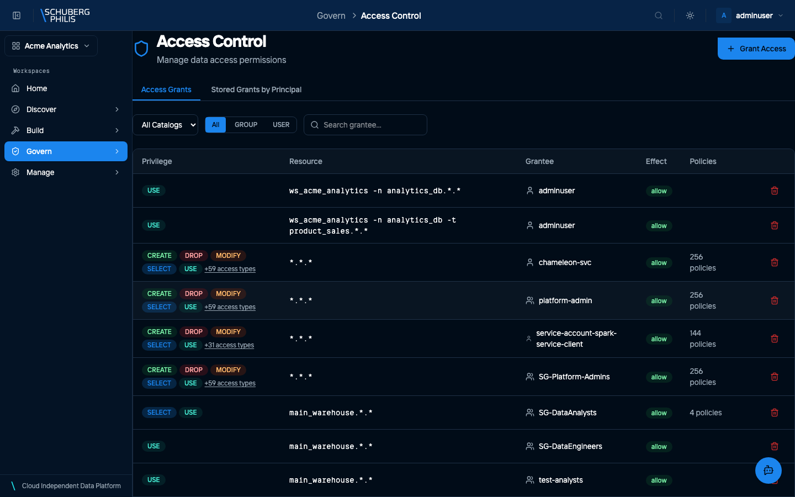
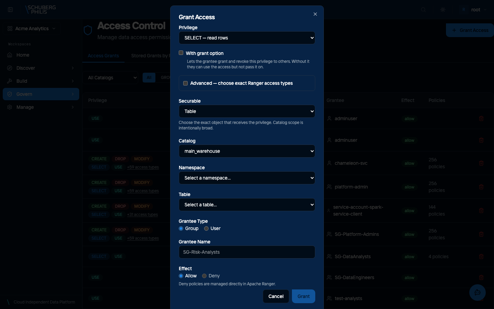

{/* GENERATED by docs-site/scripts/gen-usecases-reference.mjs.
    Steps and screenshots come from the capture run — edit the use-case in
    frontend/e2e/usecases/definitions/. Prose goes in
    src/content/use-case-intros/<id>.intro.md, and the CLI/MCP/API routes in
    src/data/use-case-surfaces.json. */}

Data access is decided by Apache Ranger, and granted per securable — a catalog, a namespace or a single table. Grants apply to the end user who runs the query, whichever engine they use, so the same permission holds across the platform.

**Who does this:** admin

## Steps

1. Open Access Control to review existing grants

   

2. Open the Grant Access dialog and choose a privilege and securable

   

## Other ways to reach this

The steps above were executed against a live platform and photographed. The
commands below were not: they are checked to exist when the documentation is
built, which is a weaker guarantee. Follow the links for arguments and options.

### Command line

- [`chameleon access grant`](/docs/reference/cli/)
- [`chameleon access revoke`](/docs/reference/cli/)
- [`chameleon access show`](/docs/reference/cli/)

### MCP tools

- [`grant_table_access`](/docs/reference/mcp-tools/)
- [`revoke_table_access`](/docs/reference/mcp-tools/)

### HTTP API (for developers)

- [`POST /api/platform/v1/access/grant`](/docs/reference/api/operations/grant_access_api_platform_v1_access_grant_post/)
- [`POST /api/platform/v1/access/revoke`](/docs/reference/api/operations/revoke_access_api_platform_v1_access_revoke_post/)
- [`GET /api/platform/v1/access/grants`](/docs/reference/api/operations/show_grants_api_platform_v1_access_grants_get/)
