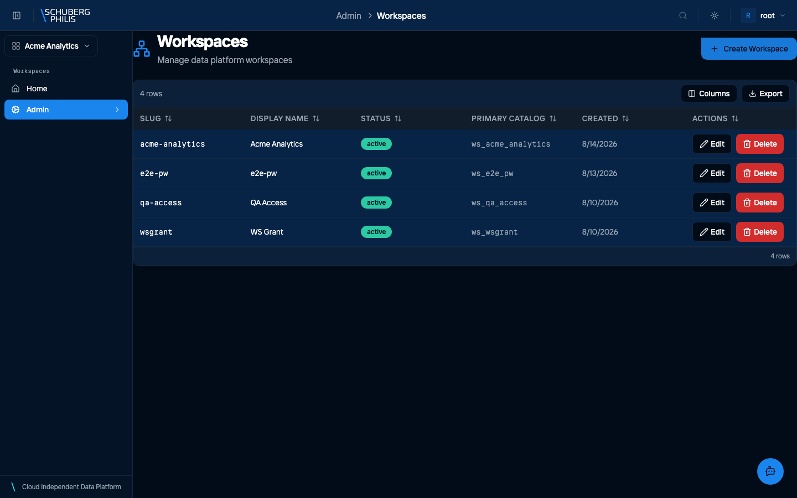

{/* GENERATED by docs-site/scripts/gen-usecases-reference.mjs.
    Steps and screenshots come from the capture run — edit the use-case in
    frontend/e2e/usecases/definitions/. Prose goes in
    src/content/use-case-intros/<id>.intro.md, and the CLI/MCP/API routes in
    src/data/use-case-surfaces.json. */}

A workspace is the unit of tenancy: it owns a catalog, its own storage buckets, and the Keycloak groups whose members administer or use it. One catalog belongs to exactly one workspace, which is what keeps tenants separated in the data plane.

**Who does this:** admin

## Steps

1. Open the workspace administration page

   

## Other ways to reach this

The steps above were executed against a live platform and photographed. The
commands below were not: they are checked to exist when the documentation is
built, which is a weaker guarantee. Follow the links for arguments and options.

### Command line

- [`chameleon workspace create`](/reference/cli/)
- [`chameleon workspace list`](/reference/cli/)
- [`chameleon workspace show`](/reference/cli/)

### MCP tools

- [`create_workspace`](/reference/mcp-tools/)
- [`list_workspaces`](/reference/mcp-tools/)
- [`show_workspace`](/reference/mcp-tools/)

### HTTP API (for developers)

- [`GET /api/platform/v1/workspaces`](/reference/api/operations/list_workspaces_api_platform_v1_workspaces_get/)
- [`PUT /api/platform/v1/workspaces/{slug}`](/reference/api/operations/upsert_workspace_api_platform_v1_workspaces__slug__put/)

Creation is a PUT on the slug, and it is idempotent — the same request twice yields one workspace.
