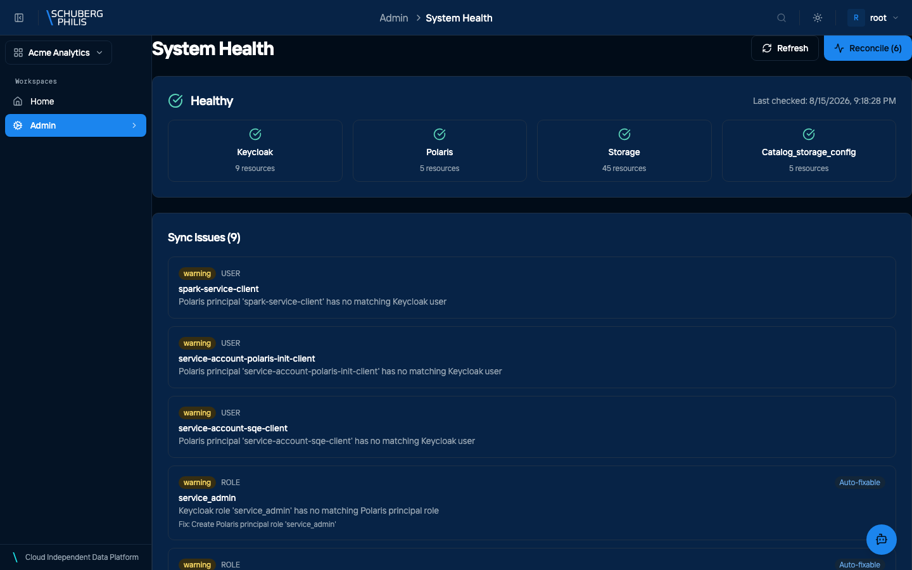

{/* GENERATED by docs-site/scripts/gen-usecases-reference.mjs.
    Steps and screenshots come from the capture run — edit the use-case in
    frontend/e2e/usecases/definitions/. Prose goes in
    src/content/use-case-intros/<id>.intro.md, and the CLI/MCP/API routes in
    src/data/use-case-surfaces.json. */}

The platform is several services — identity, catalog, authorization, query engines, storage — and the health view reports each one rather than a single green light, so a degraded component is visible before it becomes a failed query.

The overview answers "is the platform up?"; System Health answers "which part
isn't?". Each component reports for itself, so a single degraded dependency is
visible as that dependency rather than as a vague outage.

The one worth knowing by name is the **authorization** service. Access decisions
fail closed, which is the right default and an unhelpful symptom: when the decider
is unhealthy, reads are denied rather than erroring, so data looks *missing*
instead of unavailable. If several people report that tables have vanished, check
here before you go looking for the data.

The same logic applies to the catalog service. Tables live in your object storage
and the catalog is what makes them findable, so losing the catalog looks like
losing the data — while the files are exactly where they were. See
[storage and tables](/docs/concepts/storage-and-tables/).

**Who does this:** admin

## Steps

1. Open the platform overview from Govern
2. Open System Health and review each component

   

## Other ways to reach this

The steps above were executed against a live platform and photographed. The
commands below were not: they are checked to exist when the documentation is
built, which is a weaker guarantee. Follow the links for arguments and options.

### Command line

- [`chameleon admin health`](/docs/reference/cli/)

### MCP tools

- [`platform_status`](/docs/reference/mcp-tools/)

### HTTP API (for developers)

- [`GET /api/platform/v1/health`](/docs/reference/api/operations/health_check_api_platform_v1_health_get/)
- [`GET /api/platform/v1/system/validate`](/docs/reference/api/operations/validate_system_api_platform_v1_system_validate_get/)
