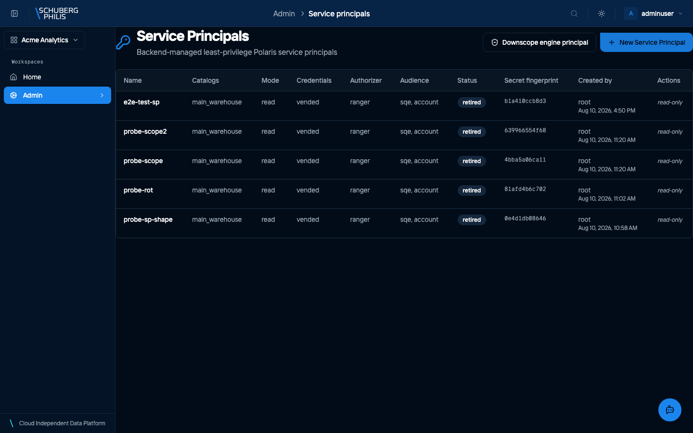

{/* GENERATED by docs-site/scripts/gen-usecases-reference.mjs.
    Steps and screenshots come from the capture run — edit the use-case in
    frontend/e2e/usecases/definitions/. Prose goes in
    src/content/use-case-intros/<id>.intro.md, and the CLI/MCP/API routes in
    src/data/use-case-surfaces.json. */}

Machines get identities too. A service principal is a confidential OIDC client in Keycloak, so an external engine or pipeline authenticates as itself and is authorized by Ranger like any user — least privilege and read-only by default, rather than sharing a human account or a static key.

A service principal is an identity for something that is not a person: a pipeline,
an external engine, a job in another system. It authenticates with OAuth2 client
credentials, and it is authorized exactly like a human identity — by grants, per
resource.

:::caution[The secret is shown once]
The client secret appears once, when you create the principal, and cannot be
retrieved afterwards — the platform stores only a fingerprint of it. Copy it then.
If it is lost, rotate: rotating issues a new secret and invalidates the old one,
so anything still using the old one stops working.
:::

Two habits that save trouble later:

- **Grant it the least it needs.** A service principal outlives the person who
  created it, and nothing prompts it to re-justify its access. Read-only unless
  something genuinely writes.
- **Bind it to a workspace when it will call a trigger.** A trigger's event
  endpoint checks that the calling principal belongs to the trigger's workspace,
  and refuses the call when it does not.

**Who does this:** admin

## Steps

1. Open the service principals page

   

## Other ways to reach this

The steps above were executed against a live platform and photographed. The
commands below were not: they are checked to exist when the documentation is
built, which is a weaker guarantee. Follow the links for arguments and options.

### Command line

No `chameleon` command manages service principals.

### MCP tools

No MCP tool manages service principals either — the portal and the HTTP API are the only two routes, so automation has to call the API.

### HTTP API (for developers)

- [`POST /api/platform/v1/service-principals`](/docs/reference/api/operations/create_service_principal_api_platform_v1_service_principals_post/)
- [`GET /api/platform/v1/service-principals`](/docs/reference/api/operations/list_service_principals_api_platform_v1_service_principals_get/)
- [`POST /api/platform/v1/service-principals/{name}/rotate-secret`](/docs/reference/api/operations/rotate_service_principal_secret_api_platform_v1_service_principals__name__rotate_secret_post/)
