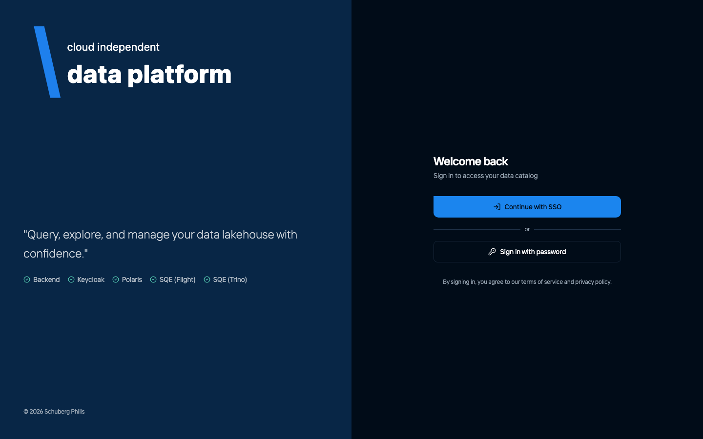
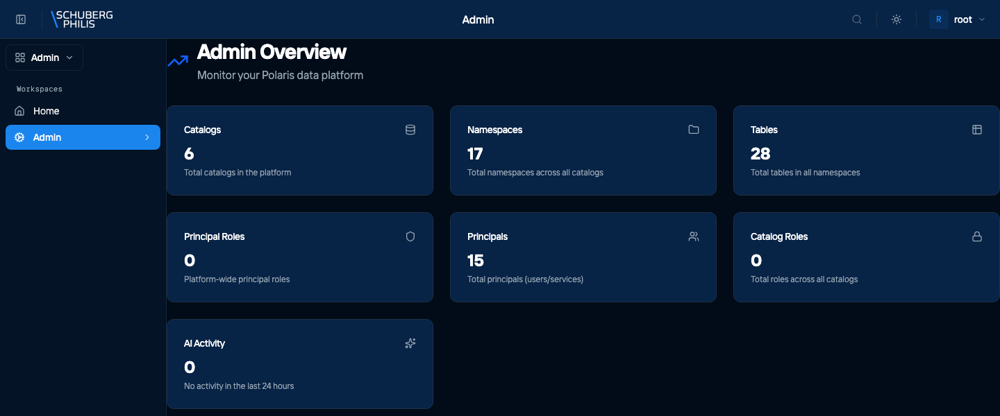

{/* GENERATED by docs-site/scripts/gen-usecases-reference.mjs.
    Steps and screenshots come from the capture run — edit the use-case in
    frontend/e2e/usecases/definitions/. Prose goes in
    src/content/use-case-intros/<id>.intro.md, and the CLI/MCP/API routes in
    src/data/use-case-surfaces.json. */}

Every session starts here. The portal authenticates through Keycloak, and the backend keeps the resulting tokens server-side — the browser only ever holds a session cookie. Where it is enabled, a direct password form is also offered for local development.

:::note
Single sign-on is the supported path. The password form appears only where
`ENABLE_DIRECT_LOGIN` is set, which is normal for a local development stack and
should not be enabled in a deployment.
:::

**Who does this:** admin

## Steps

1. Open the portal and review the sign-in options

   

2. Sign in, landing on the administration overview

   

## Other ways to reach this

The steps above were executed against a live platform and photographed. The
commands below were not: they are checked to exist when the documentation is
built, which is a weaker guarantee. Follow the links for arguments and options.

### Command line

- [`chameleon login`](/docs/reference/cli/)
- [`chameleon logout`](/docs/reference/cli/)

### MCP tools

MCP is reached with a token you already hold, so it has no sign-in tool of its own.

### HTTP API (for developers)

- [`GET /api/platform/v1/auth/login`](/docs/reference/api/operations/login_api_platform_v1_auth_login_get/)
- [`POST /api/platform/v1/auth/direct-login`](/docs/reference/api/operations/direct_login_api_platform_v1_auth_direct_login_post/)
- [`GET /api/platform/v1/auth/me`](/docs/reference/api/operations/get_current_user_api_platform_v1_auth_me_get/)

`direct-login` exists for local development and is disabled unless ENABLE_DIRECT_LOGIN is set.
