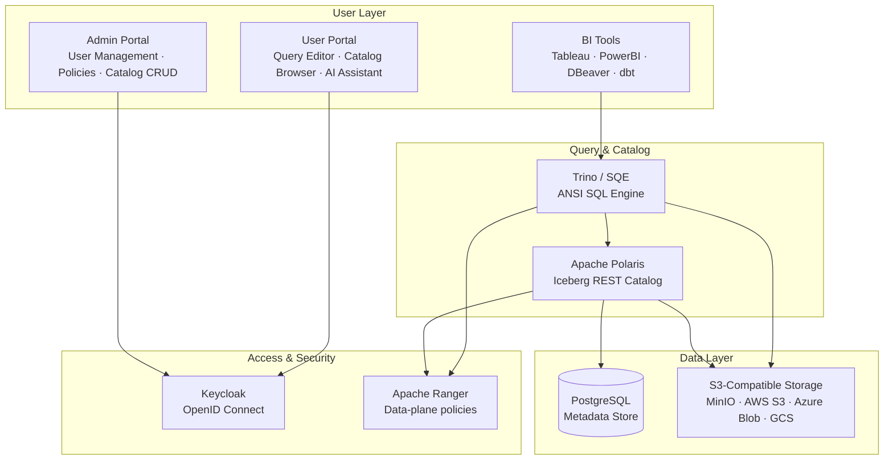
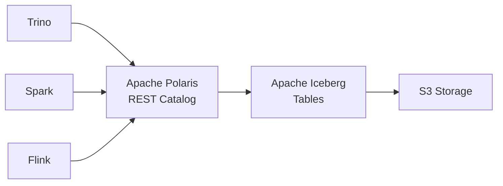
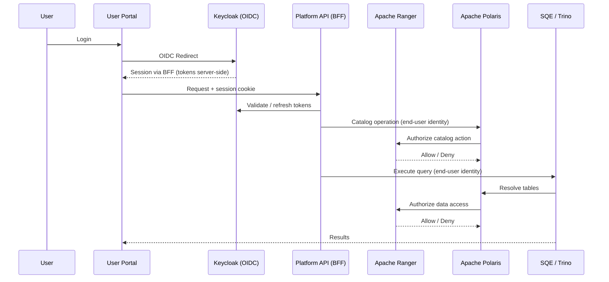
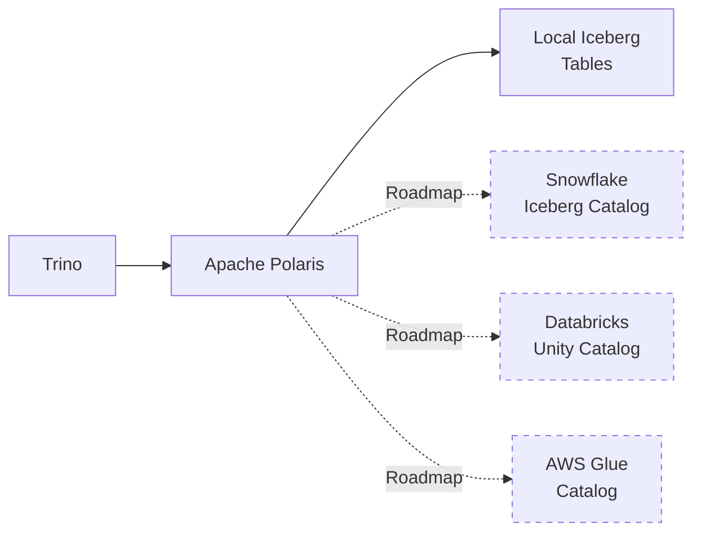
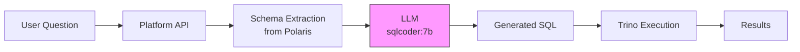
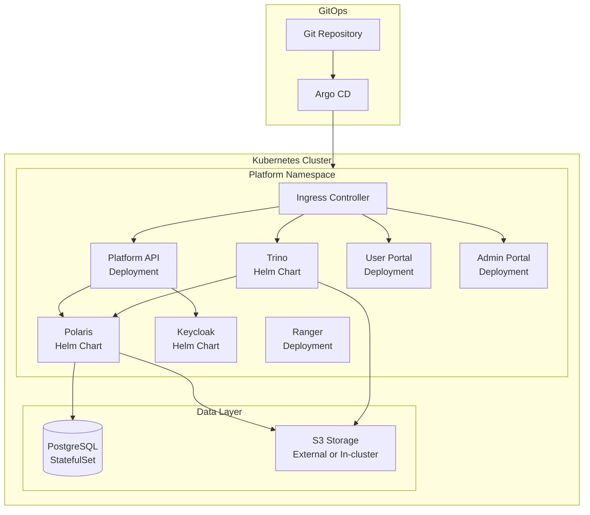

# Cloud Independent Data Platform

**Own your data. Run anywhere. Zero lock-in.**

> A sovereign, open-source data platform built on Apache Iceberg, Polaris, Trino, and Apache Ranger.
> Enterprise-grade security, AI-powered analytics, and total cloud independence.

---

## The Problem

Organizations face three converging challenges with their data infrastructure:

**Vendor lock-in** — Cloud-native data warehouses create deep dependency on a single provider. Migrating away costs millions and takes years.

**Data sovereignty** — Regulations like GDPR, DORA, and NIS2 demand control over where data lives and who can access it. Proprietary platforms make compliance a moving target.

**Fragmented tooling** — Teams cobble together catalogs, query engines, access control, and storage — each with its own API, its own auth model, and its own upgrade cycle.

The result: rising costs, audit nightmares, and an architecture that serves the vendor more than the business.

---

## The Solution

A fully integrated data platform built exclusively on open standards.

| Capability | Technology | Lock-in risk |
|---|---|---|
| Data format | Apache Iceberg | None — open table format |
| Data catalog | Apache Polaris | None — open REST catalog |
| Query engine | Trino | None — ANSI SQL, JDBC/ODBC |
| Identity | Keycloak / OpenID Connect | None — any OIDC provider |
| Authorization | Apache Ranger | None — open policy engine (Polaris authorizer) |
| Storage | Any S3-compatible backend | None — standard S3 API |

**One platform. Zero proprietary dependencies. Deploy on any cloud or on-premises.**

---

## Architecture Overview

---

## Core: Apache Polaris

Apache Polaris is the **open-source Iceberg REST catalog** — the single source of truth for all table metadata.

**What it does:**
- Registers and manages Apache Iceberg tables
- Provides a standard REST API for any engine to discover tables
- Stores metadata in PostgreSQL — no proprietary lock-in
- Supports multi-catalog and multi-namespace organization

**Why it matters:**
- Any query engine (Trino, Spark, Flink, Presto) can connect through the same catalog
- Tables are portable — move between clouds without rewriting anything
- Schema evolution, partitioning, and time-travel are built into the Iceberg format

---

## Storage Independence

Your data lives in **standard Apache Iceberg format** on **any S3-compatible storage**.

| Storage Backend | Status |
|---|---|
| MinIO / RustFS | Supported |
| AWS S3 | Supported |
| Azure Blob Storage | Supported |
| Google Cloud Storage | Supported |
| Ceph / RADOS Gateway | Supported |
| On-premises S3 | Supported |

**No storage lock-in.** Swap backends without touching a single table definition. The Iceberg format guarantees portability — your data is just Parquet files and metadata JSON.

---

## Enterprise Security

Two-layer security model: **authentication** via Keycloak (OpenID Connect) and **authorization** via Apache Ranger (Polaris authorizer / engine path).

**Authentication (Keycloak)**
- OpenID Connect standard — swap for Okta, Azure AD, or any OIDC provider
- SSO, MFA, user federation, social login
- Group and role management with automatic token claims

**Authorization (Apache Ranger)**
- Single data-plane policy store for catalogs, tables, column masks, and row filters
- Polaris embeds the Ranger authorizer — enforcement is per end-user identity
- Grants dual-write from the platform Access API into Ranger policies
- Audit of allow/deny decisions for SIEM and access review

---

## Data Access via Trino

Trino provides the **ANSI SQL query engine** with standard JDBC/ODBC connectivity.

| Tool | Connection | Status |
|---|---|---|
| **Tableau** | JDBC / ODBC driver | Supported |
| **Power BI** | JDBC / ODBC driver | Supported |
| **DBeaver** | JDBC driver | Supported |
| **dbt** | trino adapter | Supported |
| **DataGrip** | JDBC driver | Supported |
| **Python / pandas** | PyHive / trino-python | Supported |
| **User Portal** | Built-in query editor | Supported |

**Why Trino:**
- Massively parallel SQL engine — scales from laptop to 1000-node clusters
- Reads directly from Iceberg tables via Polaris catalog
- Ranger integration for query-level and catalog authorization
- No data copying — queries run against data in place

---

## Catalog Federation

> *Roadmap*

Connect external data sources through Polaris catalog federation — query across clouds and platforms with a single SQL interface.

Federated catalogs enable gradual migration — keep querying existing Snowflake or Databricks tables while building out your sovereign data lake.

---

## User Portal

A built-in web application for data analysts and engineers.

**Query Editor**
- SQL editor with syntax highlighting and auto-complete
- Resizable split-pane: editor on top, results below
- Query history with execution status, duration, and row counts
- Export results *(Roadmap: CSV/Parquet download)*

**Catalog Browser**
- Expandable tree view: catalogs > namespaces > tables
- Table schema inspection with column types
- Click-to-query shortcuts

**AI Assistant**
- Natural language to SQL via local LLM (sqlcoder:7b)
- Schema-aware — automatically extracts table metadata for prompt context
- Conversation history with follow-up refinement
- "Use SQL" button copies generated query to editor
- Feedback loop: thumbs up/down with corrections

---

## Admin Portal

A dedicated management interface for platform administrators.

**User Management**
- View users and their role assignments
- Group-based access control synced from Keycloak
- Role assignment: service admin, catalog admin, table reader, data writer

**Catalog Administration**
- Create, update, and delete catalogs
- Manage namespaces and storage configuration
- Assign catalog-level roles and permissions

**Policy Editor**
- Create and manage Ranger authorization policies (Access / Grants UI)
- Subject-based rules: by role, group, or individual user
- Resource-based scoping: catalog, namespace, table (with wildcard support)
- Priority-based conflict resolution with allow/deny effects

**Audit** *(Roadmap)*
- Policy change history
- Access decision logs
- Query audit trail

---

## AI-Powered Analytics

Turn natural language into SQL — no query expertise required.

**Current capabilities:**
- Local LLM via Ollama (sqlcoder:7b) — no data leaves your infrastructure
- Schema-aware prompting: table names, column types, and relationships
- Conversation context for iterative refinement
- Feedback mechanism for continuous improvement

**Roadmap:**
- OpenAI, Azure OpenAI, and OpenRouter as alternative LLM providers
- RAG pipeline with query history for improved accuracy
- Natural language to dashboard generation

---

## Deployment

Production deployment via **Kubernetes** with Helm charts and GitOps.

| Component | Packaging | Status |
|---|---|---|
| Apache Polaris | Helm chart (v1.4.0) | Available |
| Trino | Helm chart | Available |
| Keycloak | Helm chart | Available |
| Apache Ranger | Helm / container | Available |
| Platform API | Docker image | Available |
| User Portal | Docker image | Available |
| Admin Portal | Docker image | Available |
| Argo CD GitOps | Deployment manifests | *Roadmap* |

**Development:** Full Docker Compose environment with one-command setup.
**Production:** Kubernetes with Helm charts, horizontal scaling, and GitOps delivery.

---

## Open Standards

Every layer of the platform is built on a widely adopted, vendor-neutral standard.

| Layer | Standard | Governed by |
|---|---|---|
| Table format | Apache Iceberg | Apache Software Foundation |
| Data catalog | Iceberg REST Catalog | Apache Software Foundation |
| Query language | ANSI SQL | ISO/IEC |
| Authentication | OpenID Connect (OIDC) | OpenID Foundation |
| Authorization | Apache Ranger | Apache Software Foundation |
| Storage API | S3 API | De facto standard |
| Data files | Apache Parquet | Apache Software Foundation |
| Deployment | Kubernetes + Helm | CNCF |

**No single vendor controls any component of this stack.**

---

## Roadmap

| Feature | Description | Timeline |
|---|---|---|
| **Catalog federation** | Connect Snowflake, Databricks, AWS Glue catalogs | Planned |
| **Column/row-level security** | Ranger column masks and row filters (shared with Spark/SQE) | Available |
| **Streaming ingestion** | Apache Flink for real-time data pipelines | Planned |
| **Cloud LLM providers** | OpenAI, Azure OpenAI, OpenRouter for Text-to-SQL | Planned |
| **CSV import/export** | Upload CSV to Iceberg tables, download query results | Planned |
| **Audit log viewer** | Visual audit trail for access decisions and policy changes | Planned |
| **Bucket browser** | S3 storage explorer in the admin portal | Planned |
| **Okta integration** | Direct Okta OIDC support alongside Keycloak | Planned |
| **Full GitOps deployment** | Argo CD application sets with environment promotion | Planned |

---

## Summary

| Differentiator | Cloud Independent Data Platform | Typical Cloud Data Warehouse |
|---|---|---|
| **Vendor lock-in** | Zero — fully open source | Deep — proprietary formats and APIs |
| **Data format** | Apache Iceberg (open) | Proprietary internal format |
| **Data location** | Any S3-compatible storage, any cloud, on-prem | Vendor's cloud only |
| **Identity provider** | Any OIDC provider (Keycloak, Okta, Azure AD) | Vendor-specific IAM |
| **Authorization** | Apache Ranger — policies, masks, filters; auditable | Built-in RBAC, non-portable |
| **Query engine** | Trino — standard JDBC/ODBC | Proprietary, vendor-specific drivers |
| **AI analytics** | Local or cloud LLM — your choice | Vendor's AI service |
| **Deployment** | Kubernetes, Docker, on-prem, any cloud | Vendor's managed service |
| **Exit strategy** | Walk away anytime — data is standard Iceberg/Parquet | Multi-year migration project |
| **Cost model** | Infrastructure cost only — no per-query fees | Per-query + storage + compute markup |

---

**Cloud Independent Data Platform**
*Own your data. Run anywhere. Zero lock-in.*
